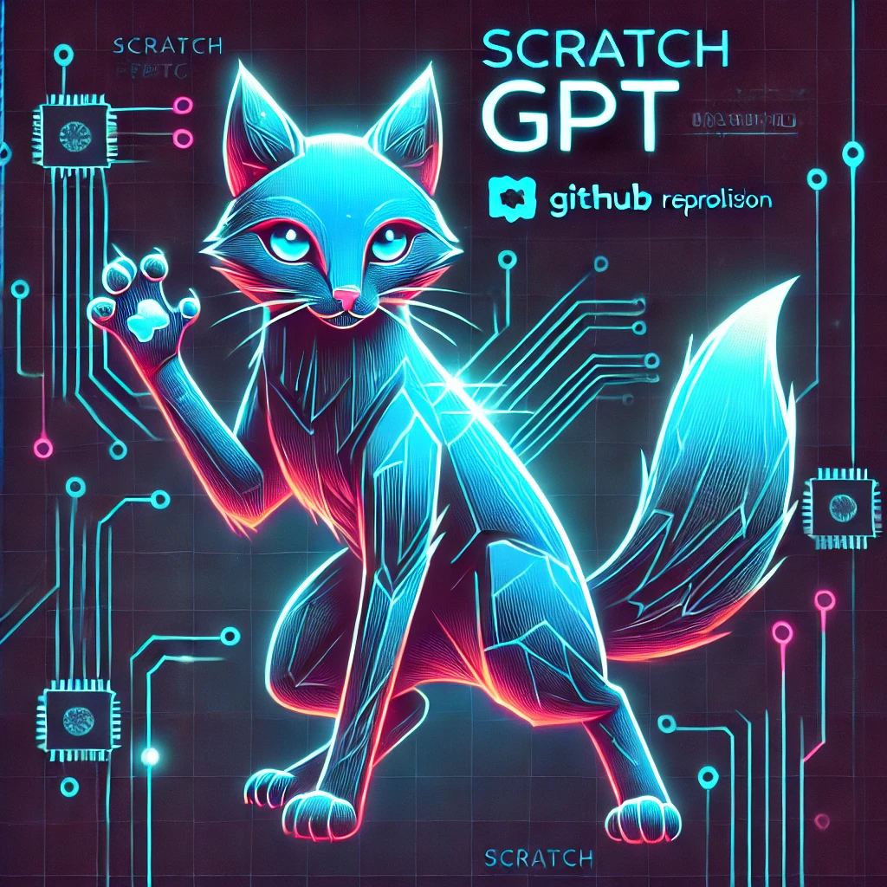

# ScratchGPT



ScratchGPT is a Python project that implements a small-scale transformer-based
language model from scratch. It provides functionality for training the model
on custom datasets and generating text based on prompts. The purpose of this
repo is educational, so the aim is to keep the code as legible as possible.

## Features

- Custom transformer architecture implementation
- Training on user-provided text data
- Text generation using the trained model
- Flexible tokenization using TikToken
- Command-line interfaces for training and inference

## Requirements

- Python 3.12+
- Poetry for dependency management

## Installation

1. Clone the repository:
   ```
   git clone https://github.com/yourusername/scratchgpt.git
   cd scratchgpt
   ```

2. Install dependencies using Poetry:
   ```
   poetry install
   ```

## Usage

### Training

To train the model on your custom dataset:

```
poetry run train -t <path_to_training_data> -e <experiment_folder>
```

- `-t, --train_source`: Path to the training data file or folder
- `-e, --experiment`: Path to the folder where experiment checkpoints will be saved


### Inference

To generate text using a trained model:

```
poetry run infer -e <experiment_folder> [-d <device>] [-m <max_tokens>]
```

- `-e, --experiment`: Path to the folder containing the trained model
- `-d, --device`: Device to run the model on (default: "cuda")
- `-m, --max_tokens`: Maximum number of tokens to generate (default: 512)

### Tokenization

To explore the TikToken tokenizer:

```
poetry run tiktoken
```

## Project Structure

- `scratchgpt/main.py`: Main training script
- `scratchgpt/infer.py`: Inference script for text generation
- `scratchgpt/model_io.py`: Utilities for saving and loading models
- `scratchgpt/tokenizer/`: Tokenizer implementations

## Development

This project uses various development tools:

- `black` for code formatting
- `isort` for import sorting
- `pylint` for linting
- `mypy` for static type checking
- `pytest` for testing

Run the following commands to ensure code quality:

```
poetry run black .
poetry run isort .
poetry run pylint scratchgpt
poetry run mypy scratchgpt
poetry run pytest
```

## Contributing

Contributions are welcome! Please feel free to submit a Pull Request.

## License

[MIT License](LICENSE)

## Authors

- Aleksandr Yeganov
- Dario Cazzani
